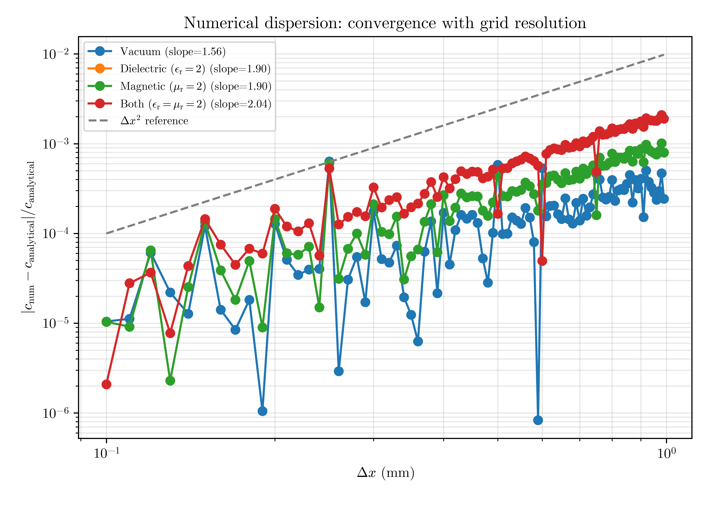
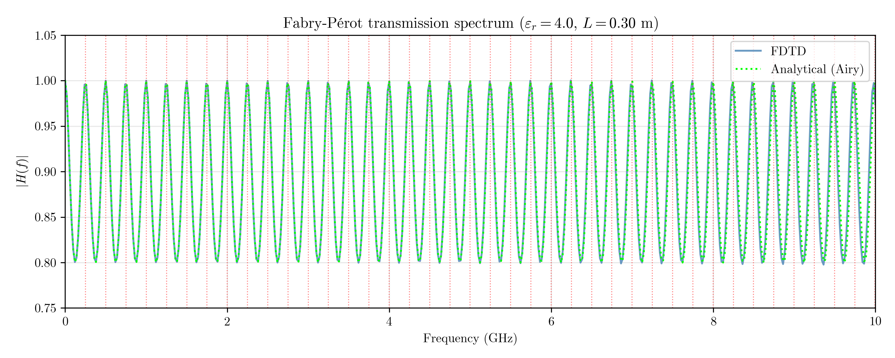

# fdtd-python

A 1D Finite-Difference Time-Domain (FDTD) solver built from scratch in Python, implementing Maxwell's equations on a staggered Yee grid. Developed as a portfolio project demonstrating applied electromagnetic simulation skills.


---

## What is FDTD?

The Finite-Difference Time-Domain method discretizes Maxwell's curl equations on a staggered grid, leapfrogging the electric field $E$ and magnetic field $H$ in both space and time. It is one of the most widely used methods in computational electromagnetics, with applications in antenna design, radar cross-section analysis, electromagnetic shielding, and RF filter design.

---

## Features

- 1D FDTD solver for $E_z$/$H_y$ polarization
- Staggered Yee grid with leapfrog time integration
- Mur absorbing boundary conditions (ABC) for open-domain simulation
- Arbitrary material profiles ($\varepsilon_\mathrm{r}$, $\mu_\mathrm{r}$) with bounds checking
- Soft Gaussian pulse sources with custom parametrization
- Courant condition check with automatic stability validation
- Field probes for time-series recording at fixed spatial positions
- Frequency-domain transfer function extraction via FFT
- Modular, documented codebase with reusable analysis utilities

---

## Notebooks

### 01 — Basic wave propagation

Demonstrates the core solver: multiple Gaussian pulse sources propagating through a heterogeneous medium with two material slabs. Shows pulse slowing inside the dielectric, partial reflection and transmission at interfaces, and clean absorption at both boundaries by the Mur ABC.


---

### 02 — Numerical dispersion analysis

Verifies that the Yee scheme is correctly **second-order accurate** by measuring the numerical wave speed $c_\text{num}$ as a function of grid resolution $\Delta x$ and comparing to the analytical wave speed.

The relative error $|c_\text{num} - c_\text{analytical}| / c_\text{analytical}$ is measured for four material cases. A log-log plot of error vs $\Delta x$ shows a slope of approximately 2, confirming second-order convergence. The dielectric and magnetic cases produce identical errors despite different impedances, confirming that $\varepsilon_\mathrm{r}$ and $\mu_\mathrm{r}$ are handled correctly and independently in the update equations.



The standard FDTD rule of thumb of **10–20 cells per pulse width** is verified: grids with fewer cells per pulse width show dramatically larger dispersion errors, as the solver correctly captures the effect of under-resolution.

---

### 03 — Reflection and transmission coefficients

Verifies the analytical **Fresnel coefficients** at a vacuum-dielectric interface for normal incidence:

$$r = \frac{1 - \sqrt{\varepsilon_\mathrm{r}}}{1 + \sqrt{\varepsilon_\mathrm{r}}}, \qquad t = \frac{2}{1 + \sqrt{\varepsilon_\mathrm{r}}}$$

A Gaussian pulse is incident on an interface at $x = 0.5$ m. The reflected and transmitted pulse amplitudes are measured at fixed positions and compared to the analytical predictions for seven values of $\varepsilon_\mathrm{r} \in [1.5, 10]$.

Key results:
- Reflected pulse is correctly **inverted** ($r < 0$) for $\varepsilon_\mathrm{r} > 1$, consistent with the phase inversion at a low-to-high impedance interface
- Energy conservation $|r|^2 + \sqrt{\varepsilon_r}|t|^2 = 1$ is satisfied to high accuracy for all cases
- Numerical errors are consistent with the second-order dispersion established in notebook 02

---

### 04 — Fabry-Pérot cavity and frequency domain analysis

Demonstrates **broadband FDTD simulation and Fourier analysis**, the standard workflow in RF engineering. A single Gaussian pulse excites all frequencies simultaneously. The transfer function

$$H(f) = \frac{E_\text{trans}(f)}{E_\text{inc}(f)}$$

gives the full frequency response of the cavity in one simulation run.

The transmission spectrum is compared to the analytical **Airy function**:

$$|H(f)|^2 = \frac{(1-R)^2}{(1-R)^2 + 4R\sin^2\!\left(\dfrac{2\pi f L_\text{slab}\sqrt{\varepsilon_r}}{c_0}\right)}$$

Resonance peaks appear at the predicted frequencies $f_m = m c_0 / (2 L_\text{slab} \sqrt{\varepsilon_r})$ with excellent agreement between FDTD and the analytical model.



A reference simulation (pure vacuum) is used to obtain a clean incident signal free of cavity reflections, following standard practice in FDTD frequency domain analysis.

---

## Physics background

The solver discretizes Maxwell's curl equations in 1D for the $E_z$/$H_y$ polarization:

$$\mu_0 \mu_\mathrm{r} \frac{\partial H_y}{\partial t} = -\frac{\partial E_z}{\partial x}, \qquad \varepsilon_0 \varepsilon_\mathrm{r} \frac{\partial E_z}{\partial t} = -\frac{\partial H_y}{\partial x}$$

using the **Yee staggered grid**: $E_z$ lives at integer spatial indices and integer timesteps, $H_y$ lives at half-integer spatial indices and half-integer timesteps. This staggering allows second-order centered differences in both space and time without interpolation.

The **Courant stability condition** requires:

$$C = \frac{c_\text{min} \Delta t}{\Delta x} \leq 1$$

where $c_\text{min} = c_0 / \sqrt{\max(\varepsilon_\mathrm{r} \mu_\mathrm{r})}$ is the minimum wave speed in the grid. The solver checks this automatically at initialization.

The **Mur absorbing boundary condition** implements the first-order Engquist-Majda condition at each boundary:

$$E_0^{n+1} = E_1^n + \kappa \left(E_1^{n+1} - E_0^n\right), \qquad \kappa = \frac{c\Delta t - \Delta x}{c\Delta t + \Delta x}$$

---

## Getting started

```bash
git clone https://github.com/LMaiselLiceran/fdtd-python.git
cd fdtd-python
pip install numpy matplotlib jupyter
jupyter notebook
```

Open any notebook in `notebooks/` and run all cells.

---

## Roadmap

- [ ] Notebook 05: EM shielding of a conducting enclosure
- [ ] Notebook 06: Energy conservation validation
- [ ] Notebook 07: Impedance matching and quarter-wave layers
- [ ] 2D FDTD extension: wave scattering off a PEC cylinder
- [ ] Perfectly Matched Layer (PML) absorbing boundaries
- [ ] Total-Field/Scattered-Field (TF/SF) plane wave injection

---

## References

- A. Taflove & S. Hagness, *Computational Electrodynamics: The Finite-Difference Time-Domain Method*, Artech House, 3rd ed. (2005)
- J. B. Schneider, *Understanding the Finite-Difference Time-Domain Method* (free online textbook)
- K. S. Yee, "Numerical solution of initial boundary value problems involving Maxwell's equations in isotropic media," *IEEE Trans. Antennas Propag.*, 14(3), 302–307 (1966)

---

## License

MIT License — see [LICENSE](LICENSE) for details.
